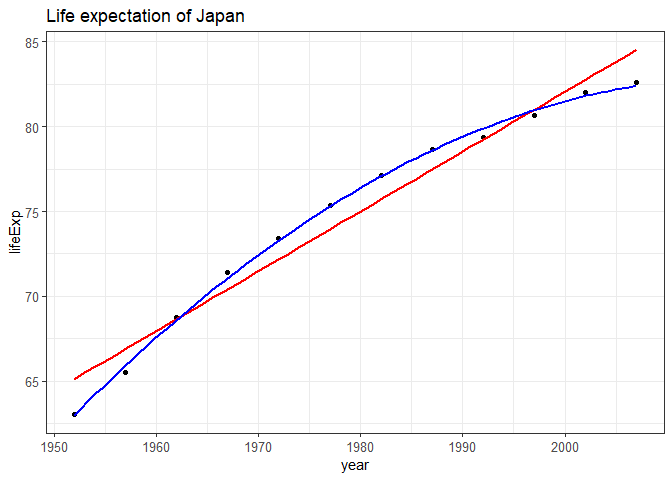
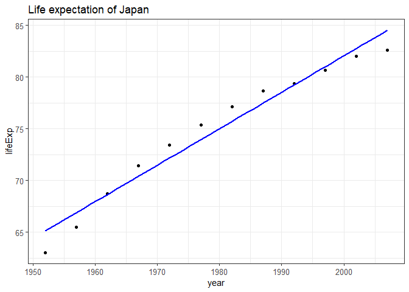

Hw-06-ChenchenGuo
================
Chenchen GUO
NOV 7th, 2018

-   [Introduction](#introduction)

    -[Goals](#goals)
-   [Part1: Character data](#part-1-character-data)

    -[Requirements](#requirements)

    -[Implementation](#implementation)

-   [Part2: Writing functions](#part-2-writing-functions)

    -[Requirements2](#requirements2)

    -[Implementation2](#implementation2)

Introduction
------------

[Homework 06](http://stat545.com/Classroom/assignments/hw06/hw06.html): Data wrangling wrap up

Goals:
------

The first assignment of STAT 547M, complete two of the six topics.

Part 1: Character data
----------------------

Requirements
------------

Work the exercises in the Strings chapter or R for data science.

Implementation
--------------

Strings charpter

Firstly load all needed packages

``` r
suppressPackageStartupMessages(library(gapminder))
suppressPackageStartupMessages(library(tidyverse))
suppressPackageStartupMessages(library(stringr))
suppressPackageStartupMessages(library(knitr))
suppressPackageStartupMessages(library(kableExtra))
suppressPackageStartupMessages(library(stringi))
suppressPackageStartupMessages(library(broom))
suppressPackageStartupMessages(library(forecast))
```

14.2.5 Exercises
----------------

### 1. Whats the difference between paste() and paste0()? What the equivalent stringr functions of them?

``` r
(name_sports <- paste("Bas", "ket", "ball"))
```

    ## [1] "Bas ket ball"

``` r
(name_sports1 <- paste0("Bas", "ket", "ball"))
```

    ## [1] "Basketball"

``` r
# The difference between paste() and paste0() is the argument sep by default is " " for paste() and "" for paste0()

# paste0() is equivalent to str_c
(name_sports2 <- str_c("Bas", "ket", "ball"))
```

    ## [1] "Basketball"

``` r
# paste() is equivalent to str_c(.., sep = " ")
(name_sports3 <- str_c("Bas", "ket", "ball", sep = " "))
```

    ## [1] "Bas ket ball"

### 2. Describe the difference between sep and collapse arguments to str\_C()?

``` r
x <- c("a", "b", "c", "d")
y <- c("w", "x", "y", "z")
paste(x, y, sep="%%")
```

    ## [1] "a%%w" "b%%x" "c%%y" "d%%z"

``` r
paste(x, y, collapse="%%")
```

    ## [1] "a w%%b x%%c y%%d z"

``` r
paste(x, y, sep="%%", collapse=",")
```

    ## [1] "a%%w,b%%x,c%%y,d%%z"

``` r
paste(x, y, sep=",", collapse="%%")
```

    ## [1] "a,w%%b,x%%c,y%%d,z"

``` r
# Hence, the sep defines what separates the entries in those tuple-wise concatenations
# the collapse will return any concatenated pairs as part of a sigle length-1 character vector
```

### 3. Use str\_lennth() and str\_sub() to extract the middle character from a string. What will you do if the string has an even number of length?

``` r
vec_str <- "asdfghj"
vec_length <- str_length(vec_str)
str_sub(vec_str,(vec_length+1)/2, (vec_length+1)/2)
```

    ## [1] "f"

``` r
vec_str1 <- "asdfgh"
vec1_length <- str_length(vec_str1)
str_sub(vec_str1,(vec1_length)/2, (vec1_length)/2+1)
```

    ## [1] "df"

### 4. What does str\_wrap() do?

``` r
txt <- c("Jane can run quickly.  So can Dick.",
         "",
         "The quick red fox jumped over the lazy brown dog.")
writeLines(strwrap(txt, width = 25))
```

    ## Jane can run quickly.
    ## So can Dick.
    ## 
    ## The quick red fox jumped
    ## over the lazy brown dog.

``` r
writeLines(strwrap(txt, width = 30, indent=5))
```

    ##      Jane can run quickly.
    ## So can Dick.
    ## 
    ##      The quick red fox jumped
    ## over the lazy brown dog.

``` r
# strwrap can print strings into paragraphs
```

### 5. What does str\_trim() do?

``` r
vec_5 <- c("hi", "hello", "Richard Jeffeson")
vec_5
```

    ## [1] "hi"               "hello"            "Richard Jeffeson"

``` r
strtrim(vec_5, 7)
```

    ## [1] "hi"      "hello"   "Richard"

### 6. Write a function that turns a vector c("a", "b", "c") into the string a, b, and c.

``` r
vector_to_string <- function(v){
    if(length(v)==0){
        stop("NA")
    }
    if(length(v)==1){
        return(v)
    }
    str1 <- str_c(v[1:length(v)-1], collapse = ", ")
    str2 <- str_c(str1, v[length(v)], sep = ", and ")
}
vec_6 <- c("s","o","s")
(vector_to_string(vec_6))
```

    ## [1] "s, o, and s"

14.3.1.1 Exercises
------------------

### 1. Explain why each of these strings don't match a : "","\\","\\"?

    ANS: Since "\" used as a literal meaning, there needs an escape character "\" to creat regular expression. Then use a "\" to find it, and this find backslash also needs an escape character "\", Hence there are total four backslashs.

### 2. How would you match the sequence "'?

``` r
vec_31 <- "\"'\\m"
vec_31
```

    ## [1] "\"'\\m"

``` r
str_view(vec_31, pattern = "\"\\'\\\\", match = TRUE)
```

<!--html_preserve-->

<script type="application/json" data-for="htmlwidget-8e04ea229be922999327">{"x":{"html":"<ul>\n  <li><span class='match'>\"'\\<\/span>m<\/li>\n<\/ul>"},"evals":[],"jsHooks":[]}</script>
<!--/html_preserve-->
3. What patterns will the regular expression ...... match? How to represent it as a string?
-------------------------------------------------------------------------------------------

``` r
vec_312 <- "\\..\\..\\.."
writeLines(vec_312)
```

    ## \..\..\..

"\\\\" for detect "", "\\." for detecting "."

``` r
str_detect(vec_312,"\\\\\\.\\.\\\\\\.\\.\\\\\\.\\.")
```

    ## [1] TRUE

14.3.2.1 Exercises
------------------

### 1. How would you match the literal string "$^$"?

``` r
vec_321 <- "a$^$b"
vec_321
```

    ## [1] "a$^$b"

``` r
str_view(vec_321, pattern = "\\$\\^\\$", match = TRUE)
```

<!--html_preserve-->

<script type="application/json" data-for="htmlwidget-12908c88b5fb6b4ce027">{"x":{"html":"<ul>\n  <li>a<span class='match'>$^$<\/span>b<\/li>\n<\/ul>"},"evals":[],"jsHooks":[]}</script>
<!--/html_preserve-->
### 2. Given the corpus of common words in stringr::words, create regular expressions that find all words that:

        1. Start with "y"
        2. End with "x"
        3. Are exactly three letters long.
        4. Have seven letters or more.
        

``` r
str_subset(words, "^y")
```

    ## [1] "year"      "yes"       "yesterday" "yet"       "you"       "young"

``` r
str_subset(words, "x$")
```

    ## [1] "box" "sex" "six" "tax"

``` r
str_subset(words, "^...$") %>% head(10)
```

    ##  [1] "act" "add" "age" "ago" "air" "all" "and" "any" "arm" "art"

``` r
str_subset(words, "^.......") %>% head(10)
```

    ##  [1] "absolute"  "account"   "achieve"   "address"   "advertise"
    ##  [6] "afternoon" "against"   "already"   "alright"   "although"

14.3.3.1 Exercises
------------------

    \d: matches any digit.
    \s: matches any whitespace (e.g. space, tab, newline).
    [abc]: matches a, b, or c.
    [^abc]: matches anything except a, b, or c.

### 1. Create regular expressions to find all words that:

        1. Start with a vowel.
        2. That only contains consonants.
        3. End with ed, but not with eed.
        4. End with ing or ise.

``` r
str_subset(words, "^[aeiou]") %>% head(10)
```

    ##  [1] "a"        "able"     "about"    "absolute" "accept"   "account" 
    ##  [7] "achieve"  "across"   "act"      "active"

``` r
str_subset(words, "^[^aeiou]+$")
```

    ## [1] "by"  "dry" "fly" "mrs" "try" "why"

``` r
str_subset(words, "[^e]ed$")
```

    ## [1] "bed"     "hundred" "red"

``` r
str_subset(words, "i(ng|se)$")
```

    ##  [1] "advertise" "bring"     "during"    "evening"   "exercise" 
    ##  [6] "king"      "meaning"   "morning"   "otherwise" "practise" 
    ## [11] "raise"     "realise"   "ring"      "rise"      "sing"     
    ## [16] "surprise"  "thing"

### 2. Empirically verify the rule "i before e except after c"?

``` r
str_subset(words, "[^c]i[e]")
```

    ##  [1] "achieve"    "believe"    "brief"      "client"     "die"       
    ##  [6] "experience" "field"      "friend"     "lie"        "piece"     
    ## [11] "quiet"      "tie"        "view"

### 3. Is "q" always followed by a "u"?

``` r
str_view(words, pattern = "q[^u]", match = TRUE)
```

<!--html_preserve-->

<script type="application/json" data-for="htmlwidget-2267a10e66277cb7bd1b">{"x":{"html":"<ul>\n  <li><\/li>\n<\/ul>"},"evals":[],"jsHooks":[]}</script>
<!--/html_preserve-->
### 4. Write a regular expression that matches a word if its probably written in British English, not American English?

``` r
wlist <- c("colour", "color", "flavour", "flavor")

str_subset(wlist, ".+or$")
```

    ## [1] "color"  "flavor"

### 5. Create a regular expression that will match telephone numbers as commonly written in your country?

``` r
tel_numbers <- c("+1 687 8885 6837", "+44 756 8743 8831", "+86 138 8732 8471")
str_subset(tel_numbers, "^\\+86")
```

    ## [1] "+86 138 8732 8471"

14.3.4.1 Exercises
------------------

### 1. Describe the equivalents of ?, +, \* in {m,n} form.

    ? === {0,1}
    + === {1,}
    * === {0,}

### 2. Describe in words what these regular expressions match:

    1. ^.*$
    Matches any string.

    2. "\\{.+\\}"
    Matches any {} form

    3. \d{4}-\d{2}-\d{2}
    Matches dddd-dd-dd

    4. "\\\\{4}"
    Matches "\\\\"

### 3. Create regular expressions to find all words that:

    1. Start with three consonants.
    2. Have three or more vowels in a row.
    3. Have two or more vowel-consonant pairs in a row.

``` r
str_subset(words, "^[^aeiou]{3}")
```

    ##  [1] "Christ"    "Christmas" "dry"       "fly"       "mrs"      
    ##  [6] "scheme"    "school"    "straight"  "strategy"  "street"   
    ## [11] "strike"    "strong"    "structure" "system"    "three"    
    ## [16] "through"   "throw"     "try"       "type"      "why"

``` r
str_subset(words, "[aeiou]{3,}")
```

    ## [1] "beauty"   "obvious"  "previous" "quiet"    "serious"  "various"

``` r
str_subset(words, "[aeiou][^aeiou]{2,}") %>% head(10)
```

    ##  [1] "able"     "absolute" "accept"   "account"  "achieve"  "across"  
    ##  [7] "act"      "active"   "actual"   "add"

14.3.5.1 Exercises
------------------

### 1. Describe in words what these expressions will match:

    1. (.)\1\1
    Matches like: "a\1\1", cause it should be \\.

    2. "(.)(.)\\2\\1"
    Matches like: "abba", "cddc"

    3. (..)\1
    Matches like "ab\1"

    4. "(.).\\1.\\1"
    Matches a string  whose first vector also appears at the third and the fifth place.

    5. "(.)(.)(.).*\\3\\2\\1"
    Matches like "abc- anything - cba"

### 2. Construct regular expressions to match words that:

    1. Start and end with the same character.
    2. Contain a repreated pair of letters.
    3. Contain one letter repeated in at least three places.

``` r
str_subset(words, "^(.).*\\1$") %>% head(10)
```

    ##  [1] "america"   "area"      "dad"       "dead"      "depend"   
    ##  [6] "educate"   "else"      "encourage" "engine"    "europe"

``` r
str_subset(words, "(..).*\\1") %>% head(10)
```

    ##  [1] "appropriate" "church"      "condition"   "decide"      "environment"
    ##  [6] "london"      "paragraph"   "particular"  "photograph"  "prepare"

``` r
str_subset(words, "(.).*\\1.*\\1") %>% head(10)
```

    ##  [1] "appropriate" "available"   "believe"     "between"     "business"   
    ##  [6] "degree"      "difference"  "discuss"     "eleven"      "environment"

14.4.2 Exercises
----------------

### 1. For each of the following challenges, solve it by using both a singular expression and a combination of multiple str\_detect() calls.

    1. Find all words that start or end with x.
    2. Find all words that start with a vowel and end with a consonant.
    3. Are there any words that contain at least one of each different vowel?

``` r
str_subset(words, "^x|x$")
```

    ## [1] "box" "sex" "six" "tax"

``` r
str_subset(words, "^[aeiou].*[^aeiou]$") %>% head(10)
```

    ##  [1] "about"   "accept"  "account" "across"  "act"     "actual"  "add"    
    ##  [8] "address" "admit"   "affect"

``` r
str_subset(words, "(?=.*a.*)(?=.*e.*)(?=.*i.*)(?=.*o.*)(?=.*u.*)")
```

    ## character(0)

### 2. What word has the highest number of vowels? What words has the highest proportion of vowels?

``` r
# Highest number of vowels
str_count(words, "[aeiou]") %>% max()
```

    ## [1] 5

``` r
paste(words[str_count(words,"[aeiou]")==5])
```

    ## [1] "appropriate" "associate"   "available"   "colleague"   "encourage"  
    ## [6] "experience"  "individual"  "television"

``` r
# Highest proportion of vowels
vowelnumber <- str_count(words, "[aeiou]")
numberofwords <- str_count(words)
paste(words[max(vowelnumber/numberofwords)])
```

    ## [1] "a"

14.4.3.1 Exercises
------------------

### 2. From the Harvard sentences data, extract:

    1. The first word from each sentence.
    2. All words ending in ing.
    3. All plurals.

``` r
#The first word from each sentence
str_extract(sentences, pattern = "[a-zA-Z]+") %>% head(10)
```

    ##  [1] "The"   "Glue"  "It"    "These" "Rice"  "The"   "The"   "The"  
    ##  [9] "Four"  "Large"

``` r
#all words ending in ing
sent<- str_subset(sentences, "([^ ]+)ing")
str_extract(sent, "([^ ]+ing)")
```

    ##  [1] "stocking"  "spring"    "evening"   "morning"   "winding"  
    ##  [6] "living"    "king"      "Adding"    "making"    "raging"   
    ## [11] "playing"   "sleeping"  "ring"      "glaring"   "sinking"  
    ## [16] "thing"     "dying"     "Bring"     "lodging"   "filing"   
    ## [21] "making"    "morning"   "wearing"   "Bring"     "wading"   
    ## [26] "swing"     "nothing"   "Whiting"   "ring"      "ring"     
    ## [31] "morning"   "sing"      "sleeping"  "bring"     "painting" 
    ## [36] "king"      "ring"      "walking"   "bring"     "ling"     
    ## [41] "bring"     "shipping"  "spring"    "ring"      "winding"  
    ## [46] "hing"      "puzzling"  "spring"    "thing"     "landing"  
    ## [51] "thing"     "waiting"   "ring"      "whistling" "nothing"  
    ## [56] "timing"    "thing"     "spring"    "ting"      "changing" 
    ## [61] "drenching" "moving"    "working"   "ring"

``` r
# all plurals
plurals <- str_subset(sentences, "([^ ]+)s|([^ ]+)es")
str_extract(plurals, "([^ ]+)s|([^ ]+)es") %>% head(10)
```

    ##  [1] "planks"    "It's"      "Thes"      "is"        "lemons"   
    ##  [6] "was"       "hogs"      "hours"     "stockings" "was"

14.4.4.1 Exercises
------------------

### 1. Find all words that come after a "number" like "one", "two", "three"etc. Pull out both the number and the word.

``` r
numbers <- c("one", "two", "three", "four", "five", "six", "seven", "eight", "nine", "ten")
numb_match <- str_c(numbers, collapse = "|")
numb_match
```

    ## [1] "one|two|three|four|five|six|seven|eight|nine|ten"

``` r
# with next word
numb_match1  <- str_c("(", numb_match, ") ([a-zA-Z]+)")
numb_match1
```

    ## [1] "(one|two|three|four|five|six|seven|eight|nine|ten) ([a-zA-Z]+)"

``` r
has_number <- str_subset(sentences, numb_match1)
matc <- str_extract(has_number, numb_match1)
matc
```

    ##  [1] "ten served"    "one over"      "seven books"   "two met"      
    ##  [5] "two factors"   "one and"       "three lists"   "seven is"     
    ##  [9] "two when"      "one floor"     "ten inches"    "one with"     
    ## [13] "one war"       "one button"    "six minutes"   "ten years"    
    ## [17] "one in"        "ten chased"    "one like"      "two shares"   
    ## [21] "two distinct"  "one costs"     "ten two"       "five robins"  
    ## [25] "four kinds"    "one rang"      "ten him"       "three story"  
    ## [29] "ten by"        "one wall"      "three inches"  "ten your"     
    ## [33] "six comes"     "one before"    "three batches" "two leaves"

### 2. Find all contractions, separate out the pieces before and after the apostrophe.

``` r
has_contraction <- str_subset(sentences, "\\'")
word_contraction <- str_extract(has_contraction, "([A-Za-z]+)'([a-zA-Z]+)")
word_contraction
```

    ##  [1] "It's"       "man's"      "don't"      "store's"    "workmen's" 
    ##  [6] "Let's"      "sun's"      "child's"    "king's"     "It's"      
    ## [11] "don't"      "queen's"    "don't"      "pirate's"   "neighbor's"

``` r
# split up
word_contr_split <- str_split(word_contraction, "'")
word_contr_split
```

    ## [[1]]
    ## [1] "It" "s" 
    ## 
    ## [[2]]
    ## [1] "man" "s"  
    ## 
    ## [[3]]
    ## [1] "don" "t"  
    ## 
    ## [[4]]
    ## [1] "store" "s"    
    ## 
    ## [[5]]
    ## [1] "workmen" "s"      
    ## 
    ## [[6]]
    ## [1] "Let" "s"  
    ## 
    ## [[7]]
    ## [1] "sun" "s"  
    ## 
    ## [[8]]
    ## [1] "child" "s"    
    ## 
    ## [[9]]
    ## [1] "king" "s"   
    ## 
    ## [[10]]
    ## [1] "It" "s" 
    ## 
    ## [[11]]
    ## [1] "don" "t"  
    ## 
    ## [[12]]
    ## [1] "queen" "s"    
    ## 
    ## [[13]]
    ## [1] "don" "t"  
    ## 
    ## [[14]]
    ## [1] "pirate" "s"     
    ## 
    ## [[15]]
    ## [1] "neighbor" "s"

14.4.5.1 Exercises
------------------

### 1. Replace all forward slashes in a string with backslashes.

``` r
forslash <- c("asd/jkd", "bj/ojh","bhu/iju")
str_replace_all(forslash, "/", "\\\\") %>% 
    writeLines()
```

    ## asd\jkd
    ## bj\ojh
    ## bhu\iju

### 2. Implement a simple version of str\_to\_lower() using replace\_all()

``` r
str_replace_all(sentences, ".", tolower) %>% head(10)
```

    ##  [1] "the birch canoe slid on the smooth planks." 
    ##  [2] "glue the sheet to the dark blue background."
    ##  [3] "it's easy to tell the depth of a well."     
    ##  [4] "these days a chicken leg is a rare dish."   
    ##  [5] "rice is often served in round bowls."       
    ##  [6] "the juice of lemons makes fine punch."      
    ##  [7] "the box was thrown beside the parked truck."
    ##  [8] "the hogs were fed chopped corn and garbage."
    ##  [9] "four hours of steady work faced us."        
    ## [10] "large size in stockings is hard to sell."

### 3. Switch the first and last letters in words. Which of those strings are still words?

``` r
new_word <- str_replace(words, "(^[a-zA-Z])([a-zA-Z]*)([a-zA-Z]$)", "\\3\\2\\1")
intersect(words, new_word)
```

    ##  [1] "a"          "america"    "area"       "dad"        "dead"      
    ##  [6] "deal"       "dear"       "depend"     "dog"        "educate"   
    ## [11] "else"       "encourage"  "engine"     "europe"     "evidence"  
    ## [16] "example"    "excuse"     "exercise"   "expense"    "experience"
    ## [21] "eye"        "god"        "health"     "high"       "knock"     
    ## [26] "lead"       "level"      "local"      "nation"     "no"        
    ## [31] "non"        "on"         "rather"     "read"       "refer"     
    ## [36] "remember"   "serious"    "stairs"     "test"       "tonight"   
    ## [41] "transport"  "treat"      "trust"      "window"     "yesterday"

14.4.6.1 Exercises
------------------

### 1. Split up a string like "apples, pears, and bananas" into individual components.

``` r
fruitstring <- "apples, pears, and bananas"
str_split(fruitstring, boundary("word"))
```

    ## [[1]]
    ## [1] "apples"  "pears"   "and"     "bananas"

### 2. Why is it better to split up by boundary("word") than " "?

    If using the " " , the punctuation will also be separated.

### 3. What does splitting with an empty string ("")do?

    To separate each word of a string.

14.5.1 Exercises
----------------

### 1. How would you find all strings containing  with regex() vs. with fixed()?

``` r
vec_51 <- c("exercise\\51")
vec_51
```

    ## [1] "exercise\\51"

``` r
str_view(vec_51, pattern = "\\\\")
```

<!--html_preserve-->

<script type="application/json" data-for="htmlwidget-00ef5a5c3d1e06572d0a">{"x":{"html":"<ul>\n  <li>exercise<span class='match'>\\<\/span>51<\/li>\n<\/ul>"},"evals":[],"jsHooks":[]}</script>
<!--/html_preserve-->
``` r
str_view(vec_51, pattern = fixed("\\"))
```

<!--html_preserve-->

<script type="application/json" data-for="htmlwidget-ab9e6b9e53e2794f229d">{"x":{"html":"<ul>\n  <li>exercise<span class='match'>\\<\/span>51<\/li>\n<\/ul>"},"evals":[],"jsHooks":[]}</script>
<!--/html_preserve-->
### 2. What are the five most common words in sentences?

``` r
wordnumber <- str_split(sentences, boundary("word")) %>% 
    unlist() %>% 
    str_to_lower() 
# find the number of words and list 
wordnumber %>% 
    enframe() %>% 
    group_by(value) %>% 
    count() %>% 
    arrange(desc(n)) %>% head(5)
```

    ## # A tibble: 5 x 2
    ## # Groups:   value [5]
    ##   value     n
    ##   <chr> <int>
    ## 1 the     751
    ## 2 a       202
    ## 3 of      132
    ## 4 to      123
    ## 5 and     118

14.7.1 Exercises
----------------

### 1. Find all stringi functions that:

        1. Count the number of words.
        2. Find duplicated strings.
        3. Generate random text.

``` r
#count the number of words
sen71 <- sentences %>% head(1)
sen71
```

    ## [1] "The birch canoe slid on the smooth planks."

``` r
stri_count_words(sen71)
```

    ## [1] 8

``` r
#duplicated strings

sen_duplicated <- c("apple", "apple", "banana", "orange", "orange")
stri_duplicated(sen_duplicated)
```

    ## [1] FALSE  TRUE FALSE FALSE  TRUE

``` r
#Generate random text of 5 each has length of 10
stri_rand_strings(5, 10 , pattern = "[a-z]")
```

    ## [1] "oaxdpxdppe" "boonszkhwe" "dkqbkemstc" "ayjjgdaieb" "rqkqixmidp"

Part 2: Writing functions
-------------------------

Requirements2
-------------

write one or more functions that do something useful to gapminder data.

Implementation2
---------------

Implement a function on dataframe of Japan

``` r
Dfjapan <- gapminder %>% 
    filter(country=="Japan")
```

Here I used a quadratic regression (with a squared term) for Japan's lifeexpectancy.

Firstly, lets compare the linear and quadratic of Japan's lifeExp

``` r
Dfjapan %>% 
    ggplot(aes(year, lifeExp)) +
    geom_point()+
    geom_smooth(method = "lm", color = "red", se = FALSE)+
    geom_smooth(method = "lm", formula = y~x+I(x^2), color = "blue", se = FALSE)+
    theme_bw()+
    theme(
    axis.text = element_text(size = 10))+
  ggtitle("Life expectation of Japan")
```



``` r
model <- lm(lifeExp ~ year + I(year^2), Dfjapan)
summary(model)
```

    ## 
    ## Call:
    ## lm(formula = lifeExp ~ year + I(year^2), data = Dfjapan)
    ## 
    ## Residuals:
    ##      Min       1Q   Median       3Q      Max 
    ## -0.53554 -0.04259  0.07851  0.13838  0.35707 
    ## 
    ## Coefficients:
    ##               Estimate Std. Error t value Pr(>|t|)    
    ## (Intercept) -1.880e+04  1.270e+03  -14.81 1.26e-07 ***
    ## year         1.872e+01  1.283e+00   14.59 1.43e-07 ***
    ## I(year^2)   -4.640e-03  3.240e-04  -14.32 1.69e-07 ***
    ## ---
    ## Signif. codes:  0 '***' 0.001 '**' 0.01 '*' 0.05 '.' 0.1 ' ' 1
    ## 
    ## Residual standard error: 0.296 on 9 degrees of freedom
    ## Multiple R-squared:  0.9983, Adjusted R-squared:  0.9979 
    ## F-statistic:  2644 on 2 and 9 DF,  p-value: 3.435e-13

From the plot, it looks like the life expectancy fits well on quadratic model. Here the factor I is to reinforce the effect of the qudratic term. What if we didnot use the I factor?

``` r
Dfjapan %>% 
    ggplot(aes(year, lifeExp)) +
    geom_point()+
    geom_smooth(method = "lm", formula = y~x+(x^2), color = "blue", se = FALSE)+
    theme_bw()+
    theme(
    axis.text = element_text(size = 10))+
  ggtitle("Life expectation of Japan")
```



To find the best fitting curve we need to find the most related factor.

``` r
# The coefficient result of model without I factor is not correct, which can seen from the huge negative intercept value. This value represents the life expectancy at year 1952. Apparently its not negative.

coef(lm(lifeExp ~ year + year^2, Dfjapan))
```

    ##  (Intercept)         year 
    ## -623.7469389    0.3529042

``` r
# The coefficient result of model with I factor:

coef(lm(lifeExp ~ year + I(year^2), Dfjapan))
```

    ##   (Intercept)          year     I(year^2) 
    ## -1.880348e+04  1.872231e+01 -4.639910e-03

``` r
# This result is also not correct with huge intercept. And since the first year of dataframe is 1952, let's substract year 1952 to get the coefficient and the result is more reasonable.

coef(lm(lifeExp ~ I(year-1952) + I(year^2-1952^2), Dfjapan))
```

    ##        (Intercept)     I(year - 1952) I(year^2 - 1952^2) 
    ##        62.99542582        18.72230824        -0.00463991

The handy function is aim to anticipate the life expectancy from year 2012, 2017 to 2022 of japan

``` r
model3 <-lm(lifeExp ~ I(year-1952) + I(year^2-1952^2), Dfjapan)
summary(model3)
```

    ## 
    ## Call:
    ## lm(formula = lifeExp ~ I(year - 1952) + I(year^2 - 1952^2), data = Dfjapan)
    ## 
    ## Residuals:
    ##      Min       1Q   Median       3Q      Max 
    ## -0.53554 -0.04259  0.07851  0.13838  0.35707 
    ## 
    ## Coefficients:
    ##                     Estimate Std. Error t value Pr(>|t|)    
    ## (Intercept)        62.995426   0.218831  287.87  < 2e-16 ***
    ## I(year - 1952)     18.722308   1.282909   14.59 1.43e-07 ***
    ## I(year^2 - 1952^2) -0.004640   0.000324  -14.32 1.69e-07 ***
    ## ---
    ## Signif. codes:  0 '***' 0.001 '**' 0.01 '*' 0.05 '.' 0.1 ' ' 1
    ## 
    ## Residual standard error: 0.296 on 9 degrees of freedom
    ## Multiple R-squared:  0.9983, Adjusted R-squared:  0.9979 
    ## F-statistic:  2644 on 2 and 9 DF,  p-value: 3.435e-13

``` r
# Here use library forecast to anticipate data

modelarima <- arima(Dfjapan$lifeExp, order = c(1, 3,5))
forecast_1 <- forecast(modelarima, h=3, level=c(11.5))
print(forecast_1)
```

    ##    Point Forecast  Lo 11.5  Hi 11.5
    ## 13       83.44292 83.39209 83.49375
    ## 14       84.02667 83.93935 84.11399
    ## 15       84.25295 84.12487 84.38103

``` r
# The final handy function of anticipating lifeExpectancy 

anticipate <- function(country_lifeexp){
    modelarima <- arima(country_lifeexp, order = c(1, 3,5))
    forecast_1 <- forecast(modelarima, h=3, level=c(11.5))
    print(forecast_1)
}
```

compare with the original life Expectancy data with the anticipated data

``` r
knitr::kable(Dfjapan) %>% 
  kable_styling(bootstrap_options = "bordered", latex_options = "basic", full_width = F)
```

<table class="table table-bordered" style="width: auto !important; margin-left: auto; margin-right: auto;">
<thead>
<tr>
<th style="text-align:left;">
country
</th>
<th style="text-align:left;">
continent
</th>
<th style="text-align:right;">
year
</th>
<th style="text-align:right;">
lifeExp
</th>
<th style="text-align:right;">
pop
</th>
<th style="text-align:right;">
gdpPercap
</th>
</tr>
</thead>
<tbody>
<tr>
<td style="text-align:left;">
Japan
</td>
<td style="text-align:left;">
Asia
</td>
<td style="text-align:right;">
1952
</td>
<td style="text-align:right;">
63.030
</td>
<td style="text-align:right;">
86459025
</td>
<td style="text-align:right;">
3216.956
</td>
</tr>
<tr>
<td style="text-align:left;">
Japan
</td>
<td style="text-align:left;">
Asia
</td>
<td style="text-align:right;">
1957
</td>
<td style="text-align:right;">
65.500
</td>
<td style="text-align:right;">
91563009
</td>
<td style="text-align:right;">
4317.694
</td>
</tr>
<tr>
<td style="text-align:left;">
Japan
</td>
<td style="text-align:left;">
Asia
</td>
<td style="text-align:right;">
1962
</td>
<td style="text-align:right;">
68.730
</td>
<td style="text-align:right;">
95831757
</td>
<td style="text-align:right;">
6576.649
</td>
</tr>
<tr>
<td style="text-align:left;">
Japan
</td>
<td style="text-align:left;">
Asia
</td>
<td style="text-align:right;">
1967
</td>
<td style="text-align:right;">
71.430
</td>
<td style="text-align:right;">
100825279
</td>
<td style="text-align:right;">
9847.789
</td>
</tr>
<tr>
<td style="text-align:left;">
Japan
</td>
<td style="text-align:left;">
Asia
</td>
<td style="text-align:right;">
1972
</td>
<td style="text-align:right;">
73.420
</td>
<td style="text-align:right;">
107188273
</td>
<td style="text-align:right;">
14778.786
</td>
</tr>
<tr>
<td style="text-align:left;">
Japan
</td>
<td style="text-align:left;">
Asia
</td>
<td style="text-align:right;">
1977
</td>
<td style="text-align:right;">
75.380
</td>
<td style="text-align:right;">
113872473
</td>
<td style="text-align:right;">
16610.377
</td>
</tr>
<tr>
<td style="text-align:left;">
Japan
</td>
<td style="text-align:left;">
Asia
</td>
<td style="text-align:right;">
1982
</td>
<td style="text-align:right;">
77.110
</td>
<td style="text-align:right;">
118454974
</td>
<td style="text-align:right;">
19384.106
</td>
</tr>
<tr>
<td style="text-align:left;">
Japan
</td>
<td style="text-align:left;">
Asia
</td>
<td style="text-align:right;">
1987
</td>
<td style="text-align:right;">
78.670
</td>
<td style="text-align:right;">
122091325
</td>
<td style="text-align:right;">
22375.942
</td>
</tr>
<tr>
<td style="text-align:left;">
Japan
</td>
<td style="text-align:left;">
Asia
</td>
<td style="text-align:right;">
1992
</td>
<td style="text-align:right;">
79.360
</td>
<td style="text-align:right;">
124329269
</td>
<td style="text-align:right;">
26824.895
</td>
</tr>
<tr>
<td style="text-align:left;">
Japan
</td>
<td style="text-align:left;">
Asia
</td>
<td style="text-align:right;">
1997
</td>
<td style="text-align:right;">
80.690
</td>
<td style="text-align:right;">
125956499
</td>
<td style="text-align:right;">
28816.585
</td>
</tr>
<tr>
<td style="text-align:left;">
Japan
</td>
<td style="text-align:left;">
Asia
</td>
<td style="text-align:right;">
2002
</td>
<td style="text-align:right;">
82.000
</td>
<td style="text-align:right;">
127065841
</td>
<td style="text-align:right;">
28604.592
</td>
</tr>
<tr>
<td style="text-align:left;">
Japan
</td>
<td style="text-align:left;">
Asia
</td>
<td style="text-align:right;">
2007
</td>
<td style="text-align:right;">
82.603
</td>
<td style="text-align:right;">
127467972
</td>
<td style="text-align:right;">
31656.068
</td>
</tr>
</tbody>
</table>
``` r
anticipate(Dfjapan$lifeExp)
```

    ##    Point Forecast  Lo 11.5  Hi 11.5
    ## 13       83.44292 83.39209 83.49375
    ## 14       84.02667 83.93935 84.11399
    ## 15       84.25295 84.12487 84.38103

After comparison, the data is properly anticipated according to original lifeexpectancy of japan

Let's test on another country Canada

``` r
Dfcanada <- gapminder %>% 
    filter(country=="Canada")

knitr::kable(Dfcanada) %>% 
  kable_styling(bootstrap_options = "bordered", latex_options = "basic", full_width = F)
```

<table class="table table-bordered" style="width: auto !important; margin-left: auto; margin-right: auto;">
<thead>
<tr>
<th style="text-align:left;">
country
</th>
<th style="text-align:left;">
continent
</th>
<th style="text-align:right;">
year
</th>
<th style="text-align:right;">
lifeExp
</th>
<th style="text-align:right;">
pop
</th>
<th style="text-align:right;">
gdpPercap
</th>
</tr>
</thead>
<tbody>
<tr>
<td style="text-align:left;">
Canada
</td>
<td style="text-align:left;">
Americas
</td>
<td style="text-align:right;">
1952
</td>
<td style="text-align:right;">
68.750
</td>
<td style="text-align:right;">
14785584
</td>
<td style="text-align:right;">
11367.16
</td>
</tr>
<tr>
<td style="text-align:left;">
Canada
</td>
<td style="text-align:left;">
Americas
</td>
<td style="text-align:right;">
1957
</td>
<td style="text-align:right;">
69.960
</td>
<td style="text-align:right;">
17010154
</td>
<td style="text-align:right;">
12489.95
</td>
</tr>
<tr>
<td style="text-align:left;">
Canada
</td>
<td style="text-align:left;">
Americas
</td>
<td style="text-align:right;">
1962
</td>
<td style="text-align:right;">
71.300
</td>
<td style="text-align:right;">
18985849
</td>
<td style="text-align:right;">
13462.49
</td>
</tr>
<tr>
<td style="text-align:left;">
Canada
</td>
<td style="text-align:left;">
Americas
</td>
<td style="text-align:right;">
1967
</td>
<td style="text-align:right;">
72.130
</td>
<td style="text-align:right;">
20819767
</td>
<td style="text-align:right;">
16076.59
</td>
</tr>
<tr>
<td style="text-align:left;">
Canada
</td>
<td style="text-align:left;">
Americas
</td>
<td style="text-align:right;">
1972
</td>
<td style="text-align:right;">
72.880
</td>
<td style="text-align:right;">
22284500
</td>
<td style="text-align:right;">
18970.57
</td>
</tr>
<tr>
<td style="text-align:left;">
Canada
</td>
<td style="text-align:left;">
Americas
</td>
<td style="text-align:right;">
1977
</td>
<td style="text-align:right;">
74.210
</td>
<td style="text-align:right;">
23796400
</td>
<td style="text-align:right;">
22090.88
</td>
</tr>
<tr>
<td style="text-align:left;">
Canada
</td>
<td style="text-align:left;">
Americas
</td>
<td style="text-align:right;">
1982
</td>
<td style="text-align:right;">
75.760
</td>
<td style="text-align:right;">
25201900
</td>
<td style="text-align:right;">
22898.79
</td>
</tr>
<tr>
<td style="text-align:left;">
Canada
</td>
<td style="text-align:left;">
Americas
</td>
<td style="text-align:right;">
1987
</td>
<td style="text-align:right;">
76.860
</td>
<td style="text-align:right;">
26549700
</td>
<td style="text-align:right;">
26626.52
</td>
</tr>
<tr>
<td style="text-align:left;">
Canada
</td>
<td style="text-align:left;">
Americas
</td>
<td style="text-align:right;">
1992
</td>
<td style="text-align:right;">
77.950
</td>
<td style="text-align:right;">
28523502
</td>
<td style="text-align:right;">
26342.88
</td>
</tr>
<tr>
<td style="text-align:left;">
Canada
</td>
<td style="text-align:left;">
Americas
</td>
<td style="text-align:right;">
1997
</td>
<td style="text-align:right;">
78.610
</td>
<td style="text-align:right;">
30305843
</td>
<td style="text-align:right;">
28954.93
</td>
</tr>
<tr>
<td style="text-align:left;">
Canada
</td>
<td style="text-align:left;">
Americas
</td>
<td style="text-align:right;">
2002
</td>
<td style="text-align:right;">
79.770
</td>
<td style="text-align:right;">
31902268
</td>
<td style="text-align:right;">
33328.97
</td>
</tr>
<tr>
<td style="text-align:left;">
Canada
</td>
<td style="text-align:left;">
Americas
</td>
<td style="text-align:right;">
2007
</td>
<td style="text-align:right;">
80.653
</td>
<td style="text-align:right;">
33390141
</td>
<td style="text-align:right;">
36319.24
</td>
</tr>
</tbody>
</table>
``` r
anticipate(Dfcanada$lifeExp)
```

    ##    Point Forecast  Lo 11.5  Hi 11.5
    ## 13       81.77200 81.73029 81.81372
    ## 14       82.73255 82.66224 82.80286
    ## 15       83.72126 83.62314 83.81938

``` r
# The results showed this anticipated function also worked on Canada's lifeExp
```
